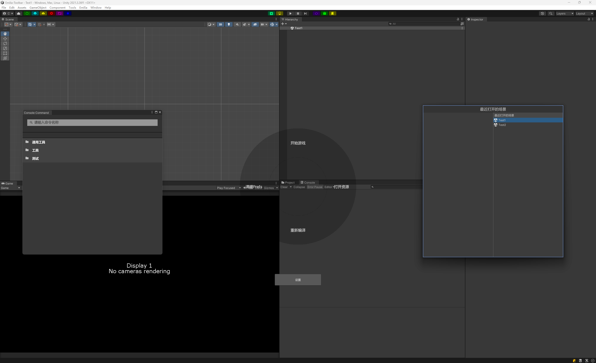
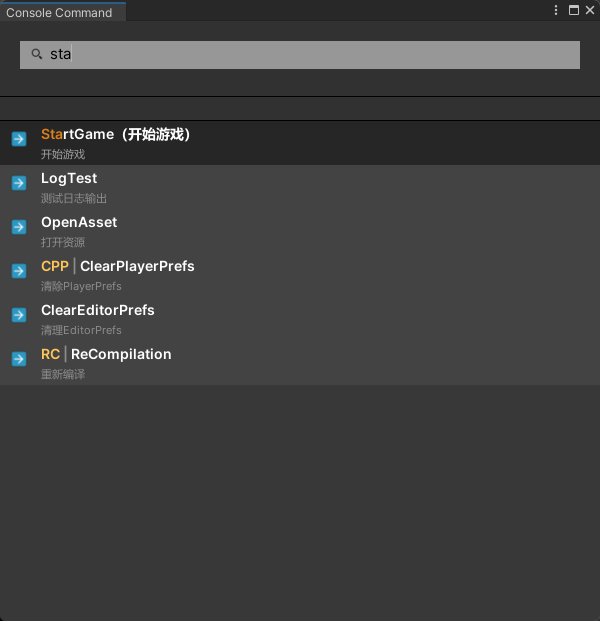
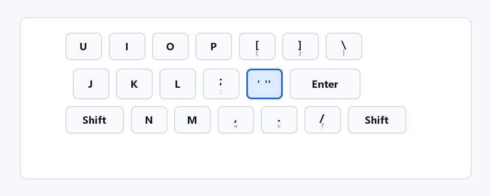
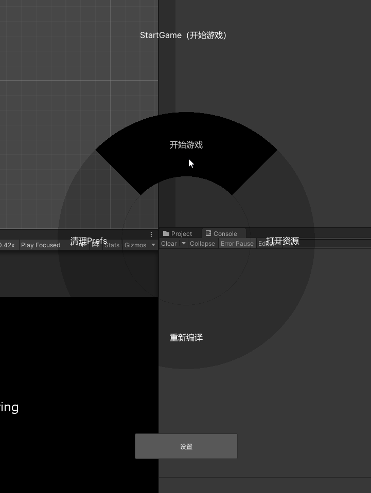
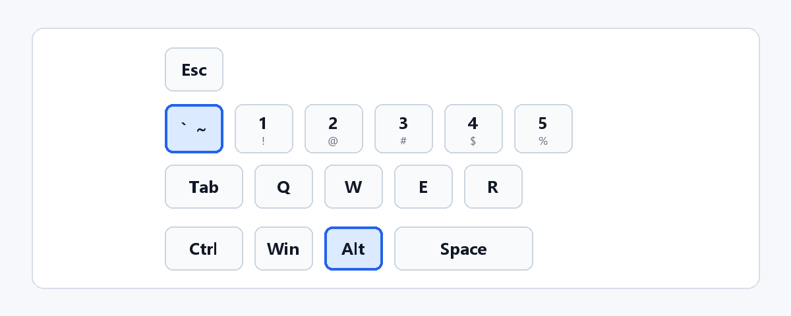
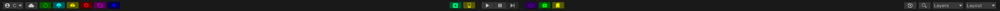
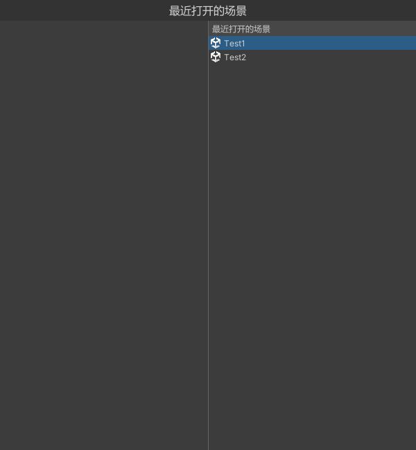
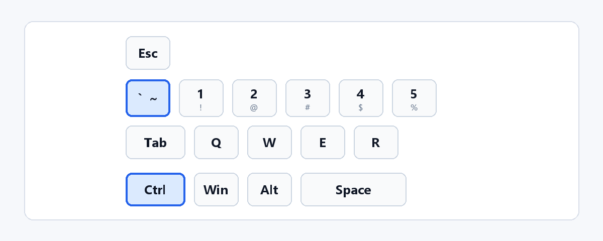

# Emilia Toolbar

Emilia Toolbar 是一个面向 Unity Editor 的工具栏与命令效率扩展。它把常用编辑器操作收敛为可搜索、可预设、可挂载到顶部工具栏和环形菜单的命令，并提供最近打开场景/Prefab 的快捷切换能力。



## 功能概览

### 命令面板



命令面板通过 `Emilia/Toolbar/Console` 或默认快捷键 `Quote` 打开，支持按名称、分类、别名和拼音搜索命令。带参数命令执行时会自动弹出参数输入窗口，适合把常用 Editor 操作集中到一个可搜索入口。



### 命令预设

预设命令可以把已有命令和参数保存为新的命令项，适合重复执行带固定参数的操作。预设入口位于 `Emilia/Toolbar/Setting/Preset`，保存后会出现在命令面板的 `Preset` 分类中。

### Ring 环形菜单



Ring 面板通过 `Alt + BackQuote` 呼出，支持中心圆环命令和左右固定命令列表。它适合放置少量高频命令，例如进入播放、打开工具窗口、清理缓存或切换常用资源。



### 顶部工具栏按钮



顶部工具栏配置入口是 `Emilia/Toolbar/Setting/Title`。命令可以挂载到标题栏左侧、播放栏左侧、播放栏右侧和标题栏右侧，并配置文字、颜色、自定义 Texture 图标或 Odin SDF 预设图标。

### Switch 快捷切换



Switch 面板通过 `Ctrl + BackQuote` 触发，当前内置最近打开场景和最近打开 Prefab 两类数据源。



按住 `Ctrl` 后连续按 `BackQuote` 可以循环选择，松开 `Ctrl` 后执行当前选中项。

## 1. 安装

### 1.1 作为 Unity 工程打开

这是当前仓库支持的主要方式。

1. 克隆仓库。
2. 使用 Unity Hub 打开仓库根目录。
3. 安装 Odin Inspector。
4. 确认 Unity Console 没有编译错误。
5. 在菜单栏确认存在 `Emilia/Toolbar/...` 菜单。

### 1.2 依赖

必需依赖：

- Odin Inspector。
- `com.emilia.kit`。
- `com.unity.editorcoroutines`，由 `com.emilia.kit` 依赖。

当前 `Packages/manifest.json` 已包含：

```json
"com.emilia.kit": "https://github.com/CCEMT/Emilia-Kit.git?path=Assets/Emilia/Kit"
```

常用入口：

| 功能 | 菜单或快捷键 |
| --- | --- |
| 命令面板 | `Emilia/Toolbar/Console`，默认快捷键 `Quote` |
| Console 设置 | `Emilia/Toolbar/Setting/Console` |
| 预设命令设置 | `Emilia/Toolbar/Setting/Preset` |
| 环形菜单设置 | `Emilia/Toolbar/Setting/Ring` |
| 顶部工具栏设置 | `Emilia/Toolbar/Setting/Title` |
| 导出全部设置 | `Emilia/Toolbar/Setting/Export All` |
| 导入全部设置 | `Emilia/Toolbar/Setting/Import All` |
| Switch 面板 | `Ctrl + BackQuote` |
| Ring 面板 | `Alt + BackQuote` |

## 注册命令

### 1 基础命令

使用 `CommandAttribute` 或 `[Command]` 标记静态方法即可注册命令：

```csharp
using Emilia.Toolbar.Editor;
using UnityEditor;

public static class GameCommands
{
    [Command("StartGame", "进入播放模式", "通用工具", "SG")]
    public static void StartGame()
    {
        EditorApplication.isPlaying = true;
    }
}
```

构造参数：

| 参数 | 说明 |
| --- | --- |
| `name` | 命令名称，必须唯一 |
| `description` | 命令描述，显示在命令面板中 |
| `category` | 分类路径，使用 `/` 分隔层级 |
| `alias` | 别名，可用于快速搜索 |
| `order` | 排序值，数值越小越靠前 |

### 2 命令校验

使用 `CommandValidationAttribute` 可以为同名命令注册可用性判断：

```csharp
using Emilia.Toolbar.Editor;
using UnityEditor;

public static class PlayModeCommands
{
    [Command("StopGame", "退出播放模式", "通用工具")]
    public static void StopGame()
    {
        EditorApplication.isPlaying = false;
    }

    [CommandValidation("StopGame")]
    private static bool CanStopGame()
    {
        return EditorApplication.isPlaying;
    }
}
```

当多个同名命令被收集时，命令缓存会优先保留校验通过的命令。

### 3 带参数命令

带参数命令执行时会打开 `ArgCommandExecuteWindow`：

```csharp
using Emilia.Kit;
using Emilia.Toolbar.Editor;
using UnityEngine;

public static class DebugCommands
{
    [Command("LogMessage", "输出一条日志", "调试")]
    public static void LogMessage([Text("消息")] string message)
    {
        Debug.Log(message);
    }

    [Command("OpenAsset", "打开资源", "资源")]
    public static void OpenAsset([Text("资源")] Object asset)
    {
        UnityEditor.AssetDatabase.OpenAsset(asset);
    }
}
```

参数默认值规则：

- 如果参数有默认值，使用该默认值。
- `string` 默认为空字符串。
- 值类型或存在无参构造函数的类型会创建默认实例。
- 其他引用类型默认为 `null`。

### 4 收集 MenuItem

在 `Emilia/Toolbar/Setting/Console` 中开启“收集 MenuItem”后，`CommandMenuItemCollect` 会收集项目中的 `MenuItem` 方法。

收集规则：

- 跳过路径包含 `internal` 的菜单。
- `MenuItem(validate = true)` 方法作为校验逻辑。
- 普通 `MenuItem` 方法作为命令动作。
- 分类会以 `MenuItem/` 开头。

### 5 自定义命令收集器

`ICommandCollect` 用于扩展命令来源。除了 `[Command]` 和可选的 `MenuItem` 收集，你也可以实现自己的命令收集逻辑，把项目内已有工具、配置或外部数据转换为 Emilia Toolbar 可执行的命令。

建议保持命令名称稳定，并为用户可见命令提供清晰的分类、描述和别名；这样命令面板、预设命令、Ring 和顶部工具栏都能更容易复用这些命令。

## 预设命令

打开 `Emilia/Toolbar/Setting/Preset` 可以创建预设命令。

预设命令用于把已有命令和参数保存成新的命令项：

1. 点击添加预设。
2. 填写名称路径，例如 `Tools/OpenLog`。
3. 选择已有命令。
4. 如果原命令有参数，填写参数值。
5. 保存。

保存后，预设命令会出现在命令面板的 `Preset` 分类下。执行预设时，如果已有参数则直接执行；如果没有参数且原命令需要参数，则打开参数输入窗口。

## 顶部工具栏按钮

打开 `Emilia/Toolbar/Setting/Title` 可以配置顶部工具栏命令按钮。

可配置区域：

- 标题栏左侧。
- 播放栏左侧。
- 播放栏右侧。
- 标题栏右侧。

每个按钮可配置：

- 颜色。
- 自定义 Texture 图标。
- Odin SDF 预设图标。
- 文本。
- 绑定命令。

保存后，按钮会通过 `UnityToolbarUtility` 注入 Unity 顶部工具栏。该实现依赖 Unity 内部 Toolbar 结构，升级 Unity 大版本后应重点验证。

## 环形菜单

打开 `Emilia/Toolbar/Setting/Ring` 可以配置环形菜单。

Ring 面板包含三类命令：

- 圆环命令：显示在中心环形区域。
- 左侧固定命令：显示在环形菜单左侧列表。
- 右侧固定命令：显示在环形菜单右侧列表。

使用方式：

1. 按住 `Alt + BackQuote` 打开 Ring 面板。
2. 移动鼠标选择圆环扇区，或点击左右固定命令。
3. 释放快捷键或点击命令执行。

圆环命令支持名称、描述、颜色、自定义 Texture 图标、Odin SDF 预设图标和绑定命令。固定命令支持名称、图标、颜色和绑定命令。

## Switch 快捷切换

Switch 面板通过 `Ctrl + BackQuote` 触发。

当前内置两个数据源：

- `RecentlyOpenedSceneSwitchSelector`：在 SceneView 聚焦时显示最近打开的场景。
- `RecentlyOpenedPrefabSwitchSelector`：在 Hierarchy 窗口聚焦时显示最近打开的 Prefab。

操作方式：

1. 按住 `Ctrl` 并按下 `BackQuote` 打开 Switch 面板。
2. 继续按 `BackQuote` 循环选择右侧列表项。
3. 松开 `Ctrl` 后执行当前选中项。
4. 也可以直接点击列表项执行。

最近打开记录按项目路径 hash 存储在 OdinEditorPrefs 中，不随设置导入导出迁移。

## 9. 自定义 Switch 数据源

实现 `ISwitchSelector` 并提供无参构造函数即可被 `SwitchInfoUtility` 自动收集：

```csharp
using Emilia.Toolbar.Editor;
using UnityEngine;

public class ExampleSwitchSelector : ISwitchSelector
{
    public int priority => 10;

    public FixedSwitchInfo[] GetFixedSwitchInfos(SwitchContext context)
    {
        return new[]
        {
            new FixedSwitchInfo
            {
                label = "Ping Selected",
                keyCode = KeyCode.P,
                action = () => Debug.Log(context.activeObject)
            }
        };
    }

    public SwitchGroup GetSwitchGroup(SwitchContext context)
    {
        return new SwitchGroup(
            "Example",
            priority,
            new[]
            {
                new SwitchInfo
                {
                    label = "Print Context",
                    action = () => Debug.Log(context.focusedWindowType)
                }
            });
    }
}
```

排序规则：

- Selector 的 `priority` 越高越先收集。
- Group 的 `priority` 越高越靠前。
- 优先级相同则按注册顺序。

`SwitchContext` 提供当前焦点窗口、选中对象、激活对象、激活 GameObject、Play Mode 状态、PrefabStage 和当前场景。

## 设置导入导出

菜单：

- `Emilia/Toolbar/Setting/Export All`
- `Emilia/Toolbar/Setting/Import All`

注意事项：

- 自定义 Texture 图标不会被嵌入 JSON，而是保存为 Unity 资源路径。
- 导入到另一个项目时，只有同路径资源存在，图标才能被恢复。
- 导入失败时会回滚到导入前设置。
- 最近打开场景/Prefab 历史和拼音搜索缓存不属于导入导出范围。

## 联系

- email：1076995595@qq.com
- QQ 群：956223592
